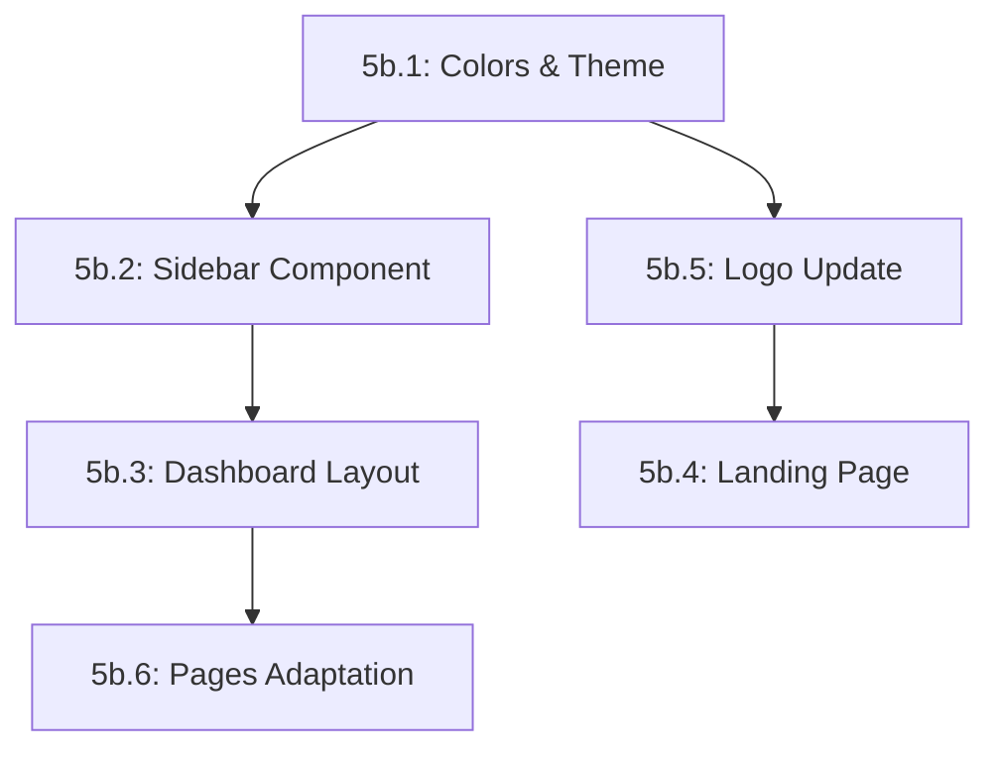

# Phase 5b: Prototype Alignment - GitHub Issues Specifications

## Overview
This document contains detailed specifications for creating GitHub Issues for Phase 5b: aligning the current project with the visual design and layout from `context-ai-prototype`.

---

## Main Issue: Phase 5b - Prototype Alignment

### Title
`Phase 5b: Prototype Alignment - UI/UX Updates`

### Labels
`enhancement`, `ui/ux`, `phase-5b`, `design`

### Description

**Objective:**
Align the current project (`context-ai-front`) with the visual design, layout, and component structure from the prototype (`context-ai-prototype`), while maintaining the architecture defined in `AGENTS.md`.

**Context:**
We have a fully functional prototype with:
- Sidebar-based navigation (shadcn/ui)
- Teal color scheme (#2D9D8E)
- Brain icon branding
- Landing page with complete sections
- Dark sidebar with collapsible navigation
- Professional dashboard layout

**Success Criteria:**
- [ ] All UI matches prototype design
- [ ] Sidebar navigation is implemented and responsive
- [ ] Color scheme updated to teal primary
- [ ] Landing page is complete
- [ ] Brain logo used throughout
- [ ] All code follows AGENTS.md guidelines
- [ ] TypeScript strict mode passes
- [ ] ESLint passes without errors
- [ ] Next.js i18n integration maintained

**Estimated Time:** 7-10 hours

---

## Sub-tasks (Issues)

### Issue 5b.1: Update Design System (Colors & Theme)

**Title:** `5b.1: Update color scheme to teal and import prototype theme variables`

**Labels:** `enhancement`, `ui/ux`, `phase-5b`, `styling`

**Description:**

**Objective:**
Update the global CSS variables to match the prototype's teal color scheme and dark sidebar theme.

**Files to Modify:**
- `src/app/globals.css`
- `tailwind.config.ts` (if needed)

**Changes Required:**

1. **Update CSS Variables in `globals.css`:**
   ```css
   :root {
     --primary: 166 72% 40%;              /* Teal primary */
     --primary-foreground: 0 0% 100%;     /* White text on teal */
     --sidebar-background: 220 20% 7%;    /* Dark sidebar */
     --sidebar-foreground: 210 15% 85%;   /* Light text on dark sidebar */
     --sidebar-primary: 166 72% 45%;      /* Teal accent in sidebar */
     --sidebar-primary-foreground: 0 0% 100%;
     --sidebar-accent: 220 15% 13%;       /* Hover state in sidebar */
     --sidebar-accent-foreground: 210 15% 85%;
     --sidebar-border: 220 15% 15%;       /* Sidebar borders */
     --sidebar-ring: 166 72% 45%;         /* Focus ring */
     /* Add all other variables from prototype */
   }
   ```

2. **Dark Mode Variables:**
   - Import all dark mode variables from prototype
   - Ensure proper contrast ratios

3. **Testing:**
   - [ ] All existing components render correctly with new colors
   - [ ] Dark mode toggle works (if implemented)
   - [ ] Accessibility contrast ratios maintained

**Reference:**
- Source: `context-ai-prototype/app/globals.css` (lines 1-99)

**Acceptance Criteria:**
- [ ] Primary color is teal (#2D9D8E / `166 72% 40%`)
- [ ] Sidebar has dark theme
- [ ] All CSS variables from prototype are imported
- [ ] No visual regressions in existing components
- [ ] Colors pass WCAG AA contrast requirements

**Estimated Time:** 30 minutes

**Priority:** 🔴 High (blocks other tasks)

---

### Issue 5b.2: Implement Sidebar Component

**Title:** `5b.2: Implement collapsible sidebar navigation with shadcn/ui`

**Labels:** `enhancement`, `component`, `phase-5b`, `ui/ux`

**Description:**

**Objective:**
Implement a professional sidebar navigation component based on shadcn/ui, matching the prototype's design.

**Files to Create:**
- `src/components/ui/sidebar.tsx` (copy from prototype)
- `src/components/ui/use-mobile.tsx` (if not exists)
- `src/components/dashboard/AppSidebar.tsx` (adapted)

**Component Structure:**

```typescript
// src/components/dashboard/AppSidebar.tsx
import { Brain, LayoutDashboard, MessageSquare, FileText, LogOut } from 'lucide-react';
import { useSession } from 'next-auth/react';
import { Sidebar, SidebarContent, SidebarFooter, SidebarHeader, ... } from '@/components/ui/sidebar';

const mainNav = [
  { title: 'Overview', href: '/[locale]/dashboard', icon: LayoutDashboard },
  { title: 'AI Chat', href: '/[locale]/chat', icon: MessageSquare },
  { title: 'Knowledge', href: '/[locale]/knowledge', icon: FileText },
];

export function AppSidebar() {
  const { data: session } = useSession();
  const pathname = usePathname();
  
  // Implementation following AGENTS.md guidelines
}
```

**Key Features:**
1. **Header:**
   - Brain icon logo
   - "Context.ai" branding

2. **Navigation:**
   - Platform section: Overview, AI Chat, Knowledge
   - Management section: Analytics, Admin (for admins only)
   - Active state highlighting
   - Tooltips on collapsed state

3. **Footer:**
   - User avatar from Auth0
   - User name and role
   - Dropdown menu with:
     - Language selector integration
     - Logout button

4. **Responsive:**
   - Collapsible on desktop
   - Drawer on mobile
   - Persist state in localStorage

**Adaptations from Prototype:**
- Replace mock data with `useSession()` from NextAuth
- Use next-intl for translations
- Add locale prefix to all routes (`/es/chat`, `/en/chat`)
- Integrate with existing `LanguageSelector` component
- Use actual user avatar from Auth0 profile

**Dependencies:**
```bash
pnpm add @radix-ui/react-separator  # If not already installed
```

**Testing:**
- [ ] Sidebar renders correctly
- [ ] Navigation links work with locale prefix
- [ ] Active state highlights current page
- [ ] User info displays from Auth0
- [ ] Logout button works
- [ ] Responsive on mobile (drawer)
- [ ] Collapsible state persists

**Acceptance Criteria:**
- [ ] `sidebar.tsx` component copied from prototype
- [ ] `AppSidebar.tsx` integrates with Auth0
- [ ] All navigation links include locale prefix
- [ ] User avatar displays correctly
- [ ] Component follows AGENTS.md structure
- [ ] TypeScript types are properly defined
- [ ] JSDoc comments added for public API
- [ ] No console errors

**Reference:**
- Source: `context-ai-prototype/components/ui/sidebar.tsx`
- Source: `context-ai-prototype/components/dashboard/app-sidebar.tsx`

**Estimated Time:** 1-2 hours

**Priority:** 🔴 High

---

### Issue 5b.3: Update Dashboard Layout with Sidebar

**Title:** `5b.3: Refactor protected layout to use sidebar instead of navbar`

**Labels:** `enhancement`, `layout`, `phase-5b`

**Description:**

**Objective:**
Update the protected routes layout to use the new sidebar component instead of the top navbar.

**Files to Modify:**
- `src/app/[locale]/(protected)/layout.tsx`

**Current Structure:**
```typescript
// Current: Top navbar
<div>
  <Navbar />
  <main>{children}</main>
</div>
```

**New Structure:**
```typescript
// New: Sidebar layout
import { SidebarProvider, SidebarInset, SidebarTrigger } from '@/components/ui/sidebar';
import { AppSidebar } from '@/components/dashboard/AppSidebar';
import { LanguageSelector } from '@/components/shared/LanguageSelector';

export default function ProtectedLayout({ children }: { children: React.ReactNode }) {
  return (
    <SidebarProvider defaultOpen>
      <AppSidebar />
      <SidebarInset>
        <header className="flex h-14 items-center gap-3 border-b border-border px-6">
          <SidebarTrigger />
          <div className="flex-1" />
          <LanguageSelector />
        </header>
        <main className="flex-1 overflow-auto p-6">
          {children}
        </main>
      </SidebarInset>
    </SidebarProvider>
  );
}
```

**Key Changes:**
1. Replace `<Navbar />` with `<AppSidebar />`
2. Add `SidebarProvider` wrapper
3. Add header with `SidebarTrigger` button
4. Move `LanguageSelector` to header
5. Ensure proper overflow handling for scrollable content

**SessionProvider & Providers:**
- Maintain existing `SessionProvider` from parent layout
- Keep `QueryProvider` integration
- Don't duplicate providers

**Testing:**
- [ ] Layout renders correctly
- [ ] Sidebar toggle works
- [ ] Language selector in header works
- [ ] Content area scrolls independently
- [ ] Session data available to sidebar
- [ ] No layout shift on load
- [ ] Responsive on all screen sizes

**Acceptance Criteria:**
- [ ] Sidebar layout implemented
- [ ] Header with trigger and language selector
- [ ] Main content area properly styled
- [ ] All existing pages render correctly
- [ ] No breaking changes to child routes
- [ ] TypeScript compiles without errors

**Reference:**
- Source: `context-ai-prototype/app/[locale]/dashboard/layout.tsx`

**Estimated Time:** 1 hour

**Priority:** 🔴 High (depends on 5b.2)

---

### Issue 5b.4: Create Landing Page Components

**Title:** `5b.4: Build complete landing page with hero, features, and CTA sections`

**Labels:** `enhancement`, `feature`, `phase-5b`, `landing-page`

**Description:**

**Objective:**
Create a professional landing page for unauthenticated users with all sections from the prototype.

**Files to Create:**
- `src/components/landing/LandingNavbar.tsx`
- `src/components/landing/HeroSection.tsx`
- `src/components/landing/FeaturesSection.tsx`
- `src/components/landing/HowItWorksSection.tsx`
- `src/components/landing/UseCasesSection.tsx`
- `src/components/landing/CtaFooter.tsx`

**File to Modify:**
- `src/app/[locale]/page.tsx` (update to use landing components)

**Translation Keys to Add:**

Add to `messages/en.json` and `messages/es.json`:
```json
{
  "landing": {
    "hero": {
      "title": "Enterprise Knowledge at Your Fingertips",
      "subtitle": "Transform your company's documents into intelligent, searchable knowledge with AI-powered RAG technology.",
      "cta": "Get Started",
      "ctaSecondary": "Watch Demo"
    },
    "features": {
      "title": "Powerful Features",
      "semantic": {
        "title": "Semantic Search",
        "description": "Find information naturally..."
      },
      // ... more features
    },
    "howItWorks": {
      "title": "How It Works",
      "steps": [...]
    },
    "useCases": {
      "title": "Use Cases",
      "hr": {...},
      "engineering": {...},
      "sales": {...}
    },
    "cta": {
      "title": "Ready to Transform Your Knowledge Management?",
      "button": "Start Free Trial"
    }
  }
}
```

**Component Requirements:**

1. **LandingNavbar:**
   - Fixed header with blur backdrop
   - Brain logo
   - Navigation links (Features, How It Works, Use Cases)
   - Language switcher
   - Sign In and Get Started buttons
   - Mobile responsive menu

2. **HeroSection:**
   - Large heading with gradient text
   - Subtitle
   - CTA buttons
   - Hero image/illustration (use placeholder)

3. **FeaturesSection:**
   - Grid layout (3 columns)
   - Icons for each feature
   - Title and description
   - Features: Semantic Search, Multi-Sector, Real-time Chat, Source Citations, Analytics, Secure

4. **HowItWorksSection:**
   - 3-4 step process
   - Numbered steps with icons
   - Clear explanations

5. **UseCasesSection:**
   - Tabs or cards for different departments
   - HR, Engineering, Sales use cases
   - Examples for each sector

6. **CtaFooter:**
   - Final call-to-action
   - Link to sign up
   - Social links (optional)

**Adaptations from Prototype:**

Replace:
```typescript
// Prototype uses custom dictionary
const { dictionary: t } = useDictionary();
```

With:
```typescript
// Use next-intl
const t = useTranslations('landing');
```

**Routing:**
- All links must include locale: `/${locale}/login`, `/${locale}/signup`
- Use `Link` from `next/link` with proper locale handling

**Styling:**
- Use new teal color scheme
- Match prototype's spacing and typography
- Ensure responsive design
- Add smooth scroll animations

**Testing:**
- [ ] All sections render correctly
- [ ] Translations work in both languages
- [ ] Links navigate to correct routes with locale
- [ ] Mobile responsive
- [ ] Animations are smooth
- [ ] Images load with optimization

**Acceptance Criteria:**
- [ ] All 6 landing components created
- [ ] Home page uses landing components
- [ ] Translations added for en and es
- [ ] next-intl integration working
- [ ] Locale routing working
- [ ] All components follow AGENTS.md guidelines
- [ ] JSDoc comments added
- [ ] TypeScript types defined
- [ ] Responsive design tested

**Reference:**
- Source: `context-ai-prototype/components/landing/*.tsx`
- Source: `context-ai-prototype/app/[locale]/page.tsx`
- Source: `context-ai-prototype/lib/dictionaries/*.json`

**Estimated Time:** 3-4 hours

**Priority:** 🟡 Medium (can be done in parallel)

---

### Issue 5b.5: Update Logo and Branding

**Title:** `5b.5: Replace MessageSquare logo with Brain icon across application`

**Labels:** `enhancement`, `ui/ux`, `phase-5b`, `branding`

**Description:**

**Objective:**
Update all instances of the MessageSquare logo to use the Brain icon, ensuring consistent branding across the application.

**Files to Modify:**
- `src/components/shared/Navbar.tsx` (if still used)
- `src/components/dashboard/AppSidebar.tsx` (already done in 5b.2)
- `src/components/landing/LandingNavbar.tsx` (done in 5b.4)
- Any other files using MessageSquare as logo

**Changes Required:**

```typescript
// Before
import { MessageSquare } from 'lucide-react';
<MessageSquare className="h-8 w-8 text-blue-600" />

// After
import { Brain } from 'lucide-react';
<Brain className="h-8 w-8 text-primary" />
```

**Branding Guidelines:**
- **Logo Icon:** Brain (from lucide-react)
- **Name:** "Context.ai" (capital C, lowercase ai)
- **Primary Color:** Teal (`text-primary` or `bg-primary`)
- **Logo Sizes:**
  - Header/Navbar: `h-8 w-8` (32px)
  - Sidebar: `h-5 w-5` (20px)
  - Favicon: Consider updating if exists

**Search and Replace:**
```bash
# Find all instances of MessageSquare
grep -r "MessageSquare" src/
```

**Testing:**
- [ ] All logos updated to Brain icon
- [ ] Logo color matches teal theme
- [ ] Logo sizes are consistent
- [ ] No remaining MessageSquare imports
- [ ] Favicon updated (if applicable)

**Acceptance Criteria:**
- [ ] Brain icon used in all navigation components
- [ ] "Context.ai" name used consistently
- [ ] Teal color applied to logos
- [ ] No MessageSquare imports remain
- [ ] Visual consistency across app

**Estimated Time:** 30 minutes

**Priority:** 🟢 Low (but quick wins)

---

### Issue 5b.6: Adapt Chat and Dashboard Pages

**Title:** `5b.6: Update chat and dashboard pages to work with sidebar layout`

**Labels:** `enhancement`, `page`, `phase-5b`

**Description:**

**Objective:**
Adjust existing chat and dashboard pages to work properly with the new sidebar layout.

**Files to Modify/Create:**
- `src/app/[locale]/(protected)/chat/page.tsx` (adjust)
- `src/app/[locale]/(protected)/dashboard/page.tsx` (create)

**Changes for Chat Page:**

Current chat uses full viewport height. With sidebar, we need to adjust:

```typescript
// Adjust container classes
<div className="flex h-full flex-col">
  {/* Remove any hardcoded viewport heights */}
  {/* Content already scrolls within ChatContainer */}
</div>
```

**Testing:**
- [ ] Chat layout works with sidebar
- [ ] Messages scroll independently
- [ ] Input stays at bottom
- [ ] No layout overflow issues

**Dashboard Page to Create:**

```typescript
// src/app/[locale]/(protected)/dashboard/page.tsx
import { useTranslations } from 'next-intl';
import { Card, CardContent, CardDescription, CardHeader, CardTitle } from '@/components/ui/card';
import { MessageSquare, FileText, Users, BarChart } from 'lucide-react';

export default function DashboardPage() {
  const t = useTranslations('dashboard');
  
  return (
    <div className="space-y-6">
      <div>
        <h1 className="text-3xl font-bold">{t('title')}</h1>
        <p className="text-muted-foreground">{t('subtitle')}</p>
      </div>
      
      <div className="grid gap-4 md:grid-cols-2 lg:grid-cols-4">
        {/* Stats cards */}
        <Card>
          <CardHeader className="flex flex-row items-center justify-between space-y-0 pb-2">
            <CardTitle className="text-sm font-medium">Total Queries</CardTitle>
            <MessageSquare className="h-4 w-4 text-muted-foreground" />
          </CardHeader>
          <CardContent>
            <div className="text-2xl font-bold">1,234</div>
            <p className="text-xs text-muted-foreground">+20% from last month</p>
          </CardContent>
        </Card>
        {/* More cards... */}
      </div>
      
      {/* Recent activity section */}
    </div>
  );
}
```

**Translation Keys to Add:**
```json
{
  "dashboard": {
    "title": "Dashboard Overview",
    "subtitle": "Monitor your knowledge management activity",
    "stats": {
      "queries": "Total Queries",
      "documents": "Documents",
      "users": "Active Users",
      "accuracy": "Accuracy"
    },
    "recentActivity": "Recent Activity"
  }
}
```

**Acceptance Criteria:**
- [ ] Chat page works with sidebar layout
- [ ] Dashboard page created with basic stats
- [ ] Both pages are responsive
- [ ] Translations added for dashboard
- [ ] No layout issues or overflow
- [ ] TypeScript compiles without errors

**Reference:**
- Source: `context-ai-prototype/app/[locale]/dashboard/page.tsx`

**Estimated Time:** 1-2 hours

**Priority:** 🟡 Medium

---

## Implementation Order



**Recommended Sequence:**
1. **5b.1** - Update colors (foundation for everything)
2. **5b.2** - Create sidebar component (needed for layout)
3. **5b.3** - Update dashboard layout (integrates sidebar)
4. **5b.6** - Adapt existing pages (works with new layout)
5. **5b.5** - Update logos (quick parallel task)
6. **5b.4** - Build landing page (can be done last)

---

## Testing Checklist

After completing all sub-tasks:

### Functionality
- [ ] All navigation links work
- [ ] Sidebar collapses/expands
- [ ] Mobile menu works
- [ ] Language switcher works
- [ ] Auth0 login/logout works
- [ ] Chat functionality intact
- [ ] Dashboard displays correctly

### Visual
- [ ] Teal color scheme applied
- [ ] Brain logo everywhere
- [ ] Dark sidebar theme
- [ ] Consistent spacing
- [ ] Responsive on all breakpoints
- [ ] No visual regressions

### Code Quality
- [ ] `pnpm type-check` passes
- [ ] `pnpm lint` passes
- [ ] `pnpm format` applied
- [ ] All AGENTS.md guidelines followed
- [ ] JSDoc comments added
- [ ] No TypeScript `any` types
- [ ] Proper error handling

### Performance
- [ ] No console errors
- [ ] No unnecessary re-renders
- [ ] Images optimized
- [ ] Smooth animations
- [ ] Fast page transitions

---

## Migration Notes

### Breaking Changes
- Top navbar replaced with sidebar (impacts all protected routes)
- Layout structure changed (may affect custom CSS)
- Color scheme updated (affects all styled components)

### Backward Compatibility
- All existing functionality preserved
- Auth0 integration unchanged
- API integration unchanged
- Data structures unchanged

### Rollback Plan
If issues arise:
1. Revert to previous commit on `feature/phase-5-final-issues`
2. Create new branch from stable point
3. Implement changes incrementally

---

## Resources

### Prototype Reference
- **Location:** `context-ai-prototype/`
- **Key Files:**
  - `app/globals.css` - Theme variables
  - `components/ui/sidebar.tsx` - Sidebar component
  - `components/dashboard/app-sidebar.tsx` - Sidebar implementation
  - `components/landing/*.tsx` - Landing page sections

### Documentation
- **AGENTS.md** - Development guidelines (MUST FOLLOW)
- **README.md** - Project setup
- **next-intl docs** - i18n implementation

### Design System
- **Colors:** Teal primary (`#2D9D8E`)
- **Fonts:** Inter (from Next.js font optimization)
- **Icons:** Lucide React
- **Components:** shadcn/ui

---

## Success Metrics

**Phase 5b is complete when:**
- ✅ All 6 sub-issues are closed
- ✅ Visual design matches prototype
- ✅ All tests pass
- ✅ Code quality checks pass
- ✅ No regressions in existing features
- ✅ Documentation updated
- ✅ Ready for Phase 6 (E2E Testing)

**Estimated Total Time:** 7-10 hours
**Estimated Completion:** [To be determined based on team capacity]

